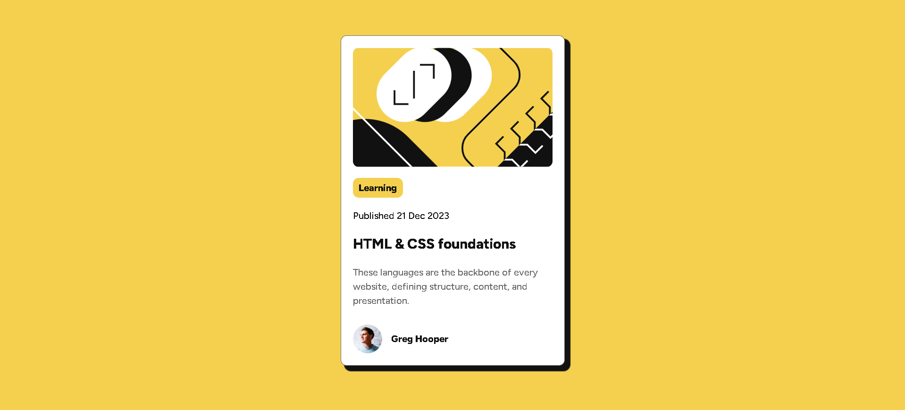
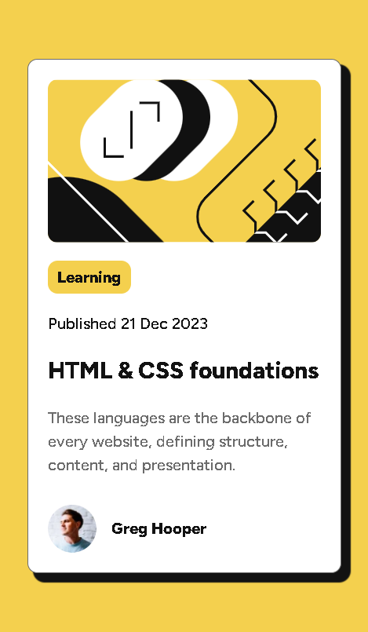

# Frontend Mentor - Blog preview card solution

This is a solution to the [Blog preview card challenge on Frontend Mentor](https://www.frontendmentor.io/challenges/blog-preview-card-ckPaj01IcS).

## Table of contents

- [Overview](#overview)
  - [The challenge](#the-challenge)
  - [Screenshot](#screenshot)
  - [Links](#links)
- [My process](#my-process)
  - [Built with](#built-with)
  - [What I learned](#what-i-learned)
  - [Useful resources](#useful-resources)
- [Author](#author)

## Overview

### The challenge

Users should be able to:

- See active states for h2 element on the page
- Box shadow
- Mobile and desktop design

### Screenshot

Desktop view

 

Mobile view

### Links

- Solution URL: [GitHub Repository](https://github.com/yourusername/blog-preview-card-main)
- Live Site URL: [Live Demo](https://bejewelled-daifuku-219c9b.netlify.app)

## My process

### Built with

- Semantic HTML5 markup
- CSS custom properties
- Flexbox
- Mobile-first workflow

### What I learned

During this project, I improved my skills in creating responsive layouts, implementing active states and using box shadow.

### Useful resources

- [CSS Tricks - A Complete Guide to Flexbox](https://css-tricks.com/snippets/css/a-guide-to-flexbox/) - This helped me understand flexbox layouts better.
- [MDN Web Docs - CSS Transitions](https://developer.mozilla.org/en-US/docs/Web/CSS/CSS_Transitions/Using_CSS_transitions) - Great reference for implementing smooth transitions.

## Author

- Frontend Mentor - [@ffozdemir](https://www.frontendmentor.io/profile/ffozdemir)
- Github - [@ffozdemir](https://github.com/ffozdemir)
